# DeadDraw
## _Game Design Document_

---

**Authors**
- Jonathan Uriel Anzures Garcia | A01277273
- Emiliano Alighieri Targiano | A01786711
- Pablo Sedano Morlett | A01785330

**Professors**
- Esteban Castillo Juarez
- Gilberto Echerria Furio
- Jose Angel Martinez

---

## Index

1. [Game Design](#1-game-design)
   1. [Summary](#11-summary)
   2. [Gameplay](#12-gameplay)
   3. [Mindset](#13-mindset)
2. [Technical](#2-technical)
   1. [Screens](#21-screens)
   2. [Controls](#22-controls)
   3. [Mechanics](#23-mechanics)
3. [Level Design](#3-level-design)
   1. [Themes](#31-themes)
   2. [Game Flow](#32-game-flow)
4. [Development](#4-development)
   1. [Abstract Classes / Components](#41-abstract-classes--components)
5. [Graphics](#5-graphics)
   1. [Style Attributes](#51-style-attributes)
   2. [Graphics Needed](#52-graphics-needed)
6. [Sounds / Music](#6-sounds--music)
   1. [Style Attributes](#61-style-attributes)
   2. [Sounds Needed](#62-sounds-needed)
   3. [Music Needed](#63-music-needed)
7. [Schedule](#7-schedule)

---

## 1. Game Design

### 1.1 Summary

DeadDraw is a single-player cyberpunk roguelite card game inspired by the design of Scoundrel and the visual presentation of Balatro. The player takes on the role of a silent mercenary trapped in a corrupt city dominated by criminal factions. Having lost his family heirloom, the protagonist must fight through a series of card-based rooms controlled by increasingly dangerous enemies. Decisions made at every turn test the player's survival instincts and strategic thinking.

The narrative is conveyed primarily through visual atmosphere rather than direct dialogue, reinforcing the game's raw and decadent tone. The primary objective is to complete runs, progress through the story, and defeat faction bosses. Once the boss is defeated, the run can continue indefinitely until the player dies, encouraging high-score chasing and replayability.

### 1.2 Gameplay

DeadDraw's gameplay is built around a room-by-room decision loop. Each room presents the player with a set of four cards drawn from the deck, representing threats, resources, and opportunities. The player chooses which card to resolve and in which order, considering both immediate impact and future consequences.

When 3 out of the 4 cards on the board have been resolved, the deck refreshes and a new set is placed. After clearing all cards in the deck, the player is rewarded and presented with a choice: open a lootbox for a randomized reward, or select a specific reward card to add to their deck. This loop repeats, with difficulty scaling after each completed deck, until the player either dies or defeats the boss.

A countdown timer runs throughout every room. If the timer reaches zero, the player loses immediately, adding pressure to every decision.

### 1.3 Mindset

DeadDraw is designed to make the player feel like a calculating survivor who must weigh every action against its cost. The card-based format constantly forces trade-offs: do you use the weapon now or save it? Can you afford to take damage from this enemy? Which reward card is worth the enemies it will add to your deck?

The cyberpunk aesthetic and atmospheric storytelling aim to immerse the player in a gritty world where every run feels like a new descent into danger. The timer creates urgency and prevents passive play, while the deck-building progression gives long-term goals beyond simple survival.

---

## 2. Technical

### 2.1 Screens

The game moves through several distinct screens, each with its own purpose and interaction model.

#### Title Screen
- The first screen the player sees when launching the game.
- Displays the DeadDraw logo and title.
- Press **Space** to continue to the next screen.
- Background visual effects reinforce the cyberpunk atmosphere.
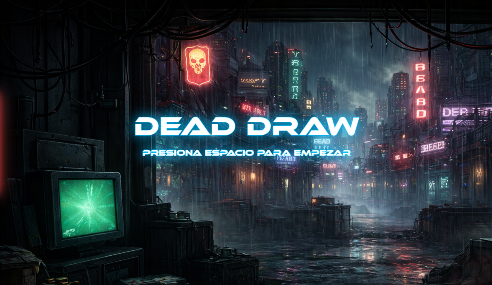

#### Main Menu
- Provides options to start a new run, log out, access settings and statistics
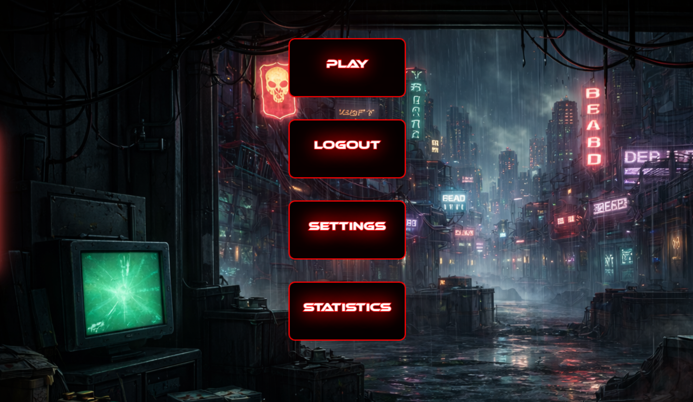

#### Deck Selection Screen
- Allows the player to choose from three different starting decks, each with a unique card composition and playstyle focus.

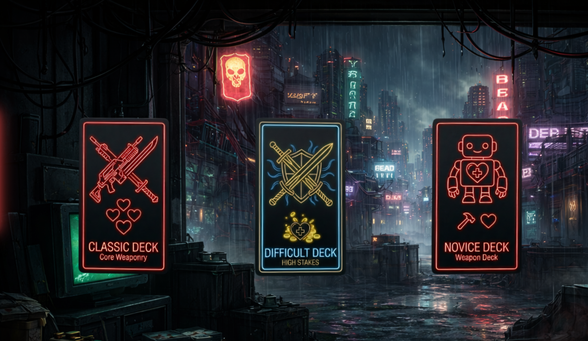

#### Lore Screen
- Plays an introductory narrative dialogue sequence at the start of each run.
- Provides story context for the protagonist and the world.
- **Left-click** advances or skips individual dialogue lines.
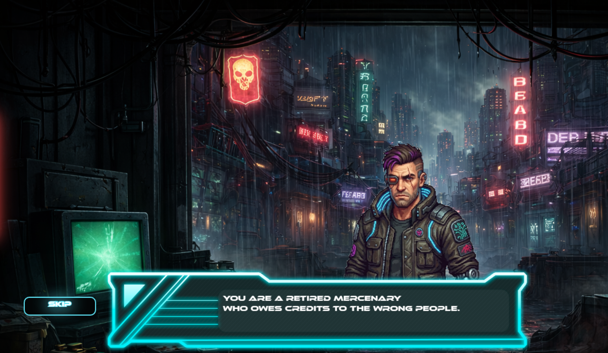

#### Main Game Screen
- The primary gameplay screen where all card interactions occur.
- Displays: the active board with four cards, the player HUD (health, money, timer), the weapon slot, and the discard pile.
- **Left-click** to select and place cards.
- The countdown timer is always visible and running.
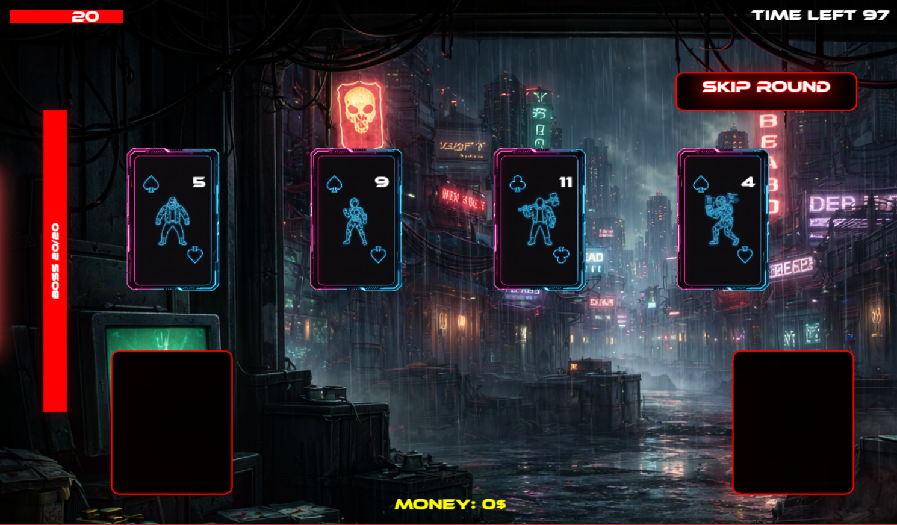

#### Card Selection Screen 
- Shown between levels after the player finishes a full deck.
- The player chooses one of three offered reward cards to add permanently to their deck.
- Each reward card may come with side-effect penalty cards added to the deck as a cost.
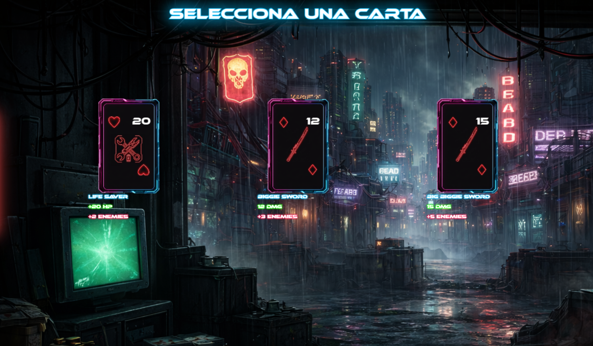

#### Lootbox Screen
- Alternative end-of-deck reward option.
- The player can open a lootbox for a randomized prize instead of picking a specific card.
- Rewards include items such as health vials or powerful weapon cards.
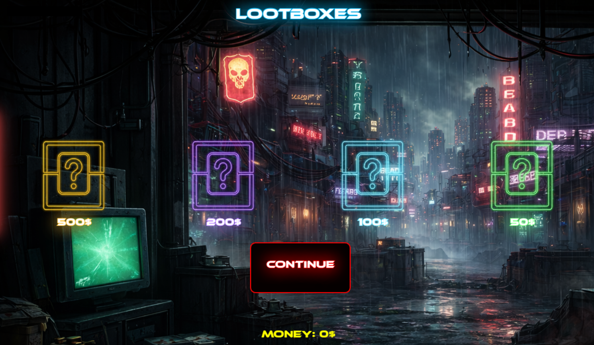

#### Win / Lose Screens
- **Win screen:** displayed when the player clears the boss encounter. Press **Space** to continue or end the run.
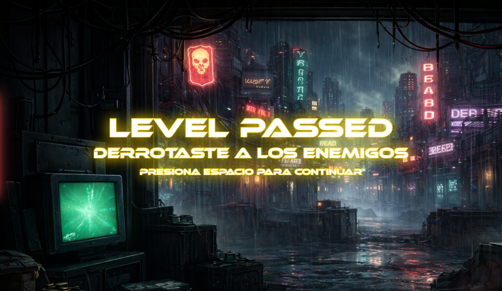
- **Lose screen:** displayed when the player's health reaches zero or the timer expires. Press **Space** to restart.
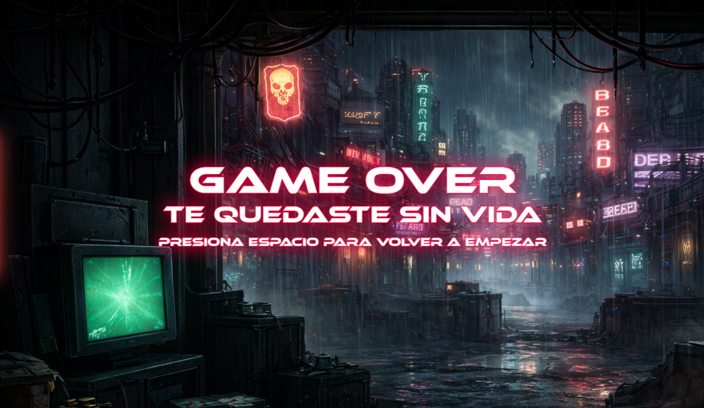

---

### 2.2 Controls

| Input | Action |
|-------|--------|
| Left Click | Select a card / place a card in a slot / click buttons / skip dialogue |
|Right Click|On cards with special attributes it shows a brief description of their ability|
| Space | Continue on win, lose, and start screens |
| P | Debug key: instantly win the current round (development only) |

---

### 2.3 Mechanics

#### Card Types

The deck is composed of three card types, each identified by suit:

- **Diamonds (Weapon Cards):** Used to fight enemies. Place in the weapon slot to equip. Enemies played against the weapon take reduced or zero damage based on the weapon's value.
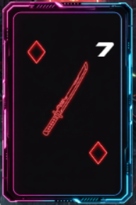

- **Spades / Clubs (Enemy Cards):** Represent threats. When played directly (without a weapon), they deal their full number value as damage to the player. When played against an equipped weapon, damage is reduced by the weapon's value.
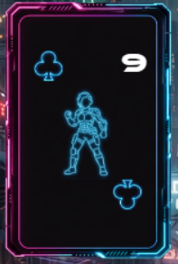 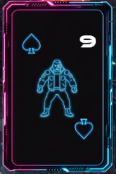
- **Hearts (Health Cards):** Restore player health by the card's number value, capped at max health (20). Only one heal card may be used per board turn.
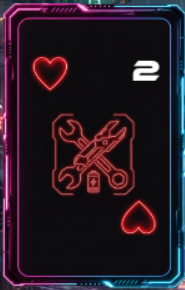

#### Starting Deck Composition

| Card Type | Suit | Count | Value Range |
|-----------|------|-------|-------------|
| Weapon | Diamonds | 10 | 1 - 10 |
| Enemy | Spades / Clubs | 30 (2 sets of 15) | 1 - 14 |
| Health | Hearts | 10 | 1 - 10 |

**Total: 50 cards**

#### Combat System

The combat loop follows the Scoundrel ruleset with original extensions:

1. Four cards are placed on the board each turn from the shuffled deck.
2. The player resolves cards one at a time in any order they choose.
3. A weapon card placed in the weapon slot stays there until discarded. Enemies must be played against the weapon in descending numerical order.
4. If the weapon value equals or exceeds the enemy value, no damage is taken.
5. If the weapon value is lower, the player takes the difference as damage.
6. An enemy played without a weapon deals its full value as damage.
7. Only one health card may be used per four-card board turn.

##### Attack Example:

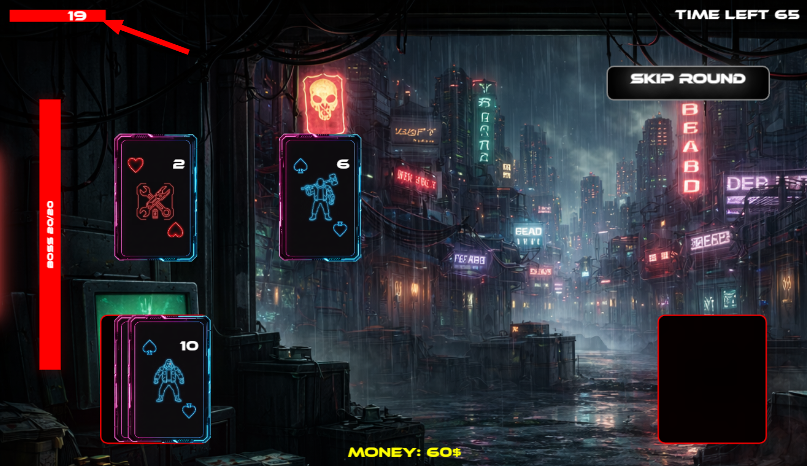
##### Healing Example:
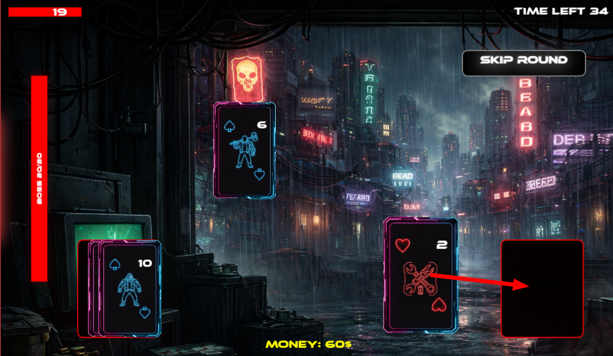
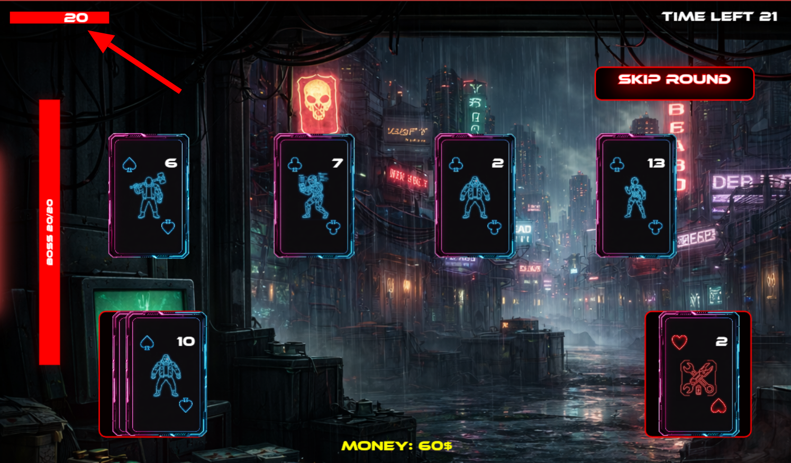
#### Weapon Special Abilities

When a player advances to a new level (by winning a round), weapon cards in the deck may randomly receive a special ability, assigned at a 90% chance:

| Ability Tag | Effect | Probability |
|-------------|--------|-------------|
| `enemieslos` | Reduces all enemy card values on the board by 1 when the weapon is equipped. | 50% |
| `killhealth` | Restores health equal to half the weapon's value when equipped. | 30% |
| `passEnemie` | Automatically discards one enemy from the board without dealing damage. | 10% |
|`healthpassEnemie`|Discards one enemy from the board and heals you by this card's full number, capped at max health. |10%|

#### Enemies Special Abilities

When a player advances to a new level (by winning a round), enemy cards in the deck may randomly receive a special ability, assigned at a 80% chance:

| Ability Tag | Effect | Probability |
|-------------|--------|-------------|
| `cursedEnemy` |When it attacks you, it deals 1 extra damage. When you defeat it with a weapon, it also steals half its number from your gold.  | 30% |
| `killhealth` | Restores health equal to half the weapon's value when equipped. | 30% |
| `timeEater` | When it attacks you, it reduces your time limit by 15 seconds. | 10% |
|`goldStealer`|When you defeat it with a weapon, you gain gold equal to half its number. |10%|

#### Countdown Timer

A countdown timer runs during every room. If it reaches zero, the player loses the round immediately, equivalent to dying. The timer resets with each new level via the `Tiempo` class, and its presence forces players to make decisions quickly rather than stalling indefinitely.

#### Difficulty Scaling

- Each time the player wins a level, a 10% difficulty multiplier is compounded onto all weapon and enemy card values.
- On a loss, the deck resets entirely to base values with no scaling.
- The player's money is preserved across levels; everything else resets.
- The time upgrades are persistent across the player's runs.

#### End-of-Deck Reward System

After clearing all cards in the current deck, the player is presented with a choice between two reward paths:

**Option A: Card Selection**
- The player is shown three cards drawn from the loot pool.
- Choosing a card adds it permanently to the deck.
- Each reward card carries side-effect penalty cards (usually extra enemy cards) added to the deck as a cost.

**Current Loot Pool:**

| Card Name | Benefit | Side Effect (Cost) |
|-----------|---------|-------------------|
| Life Saver | +20 HP | Adds 2 enemy cards to deck |
| Biggie Sword | Weapon card with 12 DMG | Adds 3 enemy cards to deck |
| Big Biggie Sword | Weapon card with 15 DMG | Adds 5 enemy cards to deck |
| The Big Mace | Reduces all enemies HP to 1 | Adds a cursed enemy card to deck |

**Option B: Lootbox**
- The player opens a lootbox in the in-game shop for a randomized reward.
- Rewards are drawn from the loot pool and are not pre-visible to the player.
- This option trades predictability for the chance of a high-value reward.

| Prize | Description | Tier |
|---|---|---|
| Kill Time Reward | Every kill grants +1 second to the timer | Unique (Gold) |
| Power Up Upgrade | Upgrades an existing power up on a random card | Rare (Purple) |
| Weapon Power Up | Grants a new power up to a random weapon | Rare (Purple) |
| More Health | Increases max health by 5 | Common (Blue) |
| More Time | Increases the time limit by 5 seconds | Common (Blue) |
| Return Money | Refunds the coins spent on this lootbox | Common (Blue) |
| Weapon Stock Up | Increases by 1 the count of a random weapon | Common (Green) |
| Heal Stock Up | Increases by 1 the count of a random healing item | Common (Green) |
| Enemy Power Up | Grants a power up to a random enemy type | Curse (Red) |
| Enemy Surge | Increases by 50% the spawn count of a random enemy | Curse (Red) |

#### Money System

The player earns money by defeating enemies using a weapon card. Money is preserved across levels even when the deck resets. It is spent in the shop / lootbox system to purchase rewards between decks.

#### Win and Loss Conditions

| Condition | Result |
|-----------|--------|
| Player health reaches 0 | Game Over. Deck resets to base values. |
| Timer reaches 0 | Game Over. Deck resets to base values. |
| All cards in the deck resolved | Victory. Difficulty scales and reward selection begins. |
| Boss defeated | Run can continue indefinitely or the player may end it. |

---

## 3. Level Design

### 3.1 Themes

DeadDraw takes place entirely within a dark cyberpunk city controlled by criminal factions. The visual language is deliberately oppressive: neon-lit shadows, rain-slicked surfaces, and decaying infrastructure. There are no bright or colorful biomes. Every room reinforces the sense of a world that has already lost.

#### Atmospheric Elements
- Dark color palette dominated by blacks, deep purples, and electric cyan / magenta neon accents.
- Ambient visual effects such as scanlines, glitches, and flickering lights.
- Enemy cards reflect criminal archetypes: enforcers, assassins, and faction soldiers.
- Boss rooms feature a distinct visual treatment to signal the heightened stakes.

#### Room Objects

**Ambient (non-interactive):**
- Neon signs and holograms
- Cracked concrete and rusted metal structures
- Scattered debris and spent shell casings
- Surveillance cameras and broken monitors

**Interactive:**
- Card board: the four active card slots per turn
- Weapon slot: receives and holds an equipped weapon card
- Discard pile: receives all used cards
- Shop / Lootbox: accessible between decks for rewards

### 3.2 Game Flow

1. The player launches the game and sees the title screen. Press **Space** to continue.
2. The lore dialogue sequence plays, establishing the protagonist's situation.
3. A pre-room dialogue sets the scene for the first encounter.
4. The main game screen loads. Four cards from the shuffled 38-card deck appear on the board.
5. The player resolves cards one at a time: equipping weapons, fighting enemies, healing, and managing the discard pile.
6. When all four board cards are resolved, four new cards are drawn from the remaining deck.
7. This continues until the full deck is exhausted.
8. Upon clearing the deck, the player chooses between opening a lootbox or selecting a reward card.
9. A new level begins: difficulty scales, the deck is shuffled (with any newly added cards), and a pre-room dialogue plays.
10. At key intervals, a boss room is triggered with scaled card values and a distinct visual environment.
11. Defeating the boss allows the player to end the run or continue for a higher score.
12. If health or the timer reaches zero at any point, a lose screen appears and the deck resets to base values.

---

## 4. Development

### 4.1 Abstract Classes / Components

#### Core Game Files

| File | Responsibility |
|------|---------------|
| `game_logic.js` | Central `Game` class: manages game state, card interactions, win/loss conditions, screen transitions, difficulty scaling, and level progression. |
| `classes.js` | Card class hierarchy: `Cards` (base), `CardEspada` (weapon), `CardEnemie` (enemy), `CardVida` (health). Also defines `Player`, `Tiempo` (timer), and `Botones` (slot zones). |
| `game_view.html` | Canvas entry point. Loads assets and starts the main render loop via `requestAnimationFrame`. |

#### Key Classes

| Class | File | Description |
|-------|------|-------------|
| `Game` | `game_logic.js` | Master game controller. Holds the deck array, board state, weapon slot, discard pile, difficulty multiplier, and player reference. |
| `Cards` | `classes.js` | Base card class. Properties: `x`, `y`, `width`, `height`, `number`, `suit`, `scale`, `used`, `inboard`, `enMazo`, `habilidad`, `img`. |
| `CardEspada` | `classes.js` | Weapon card. Implements `arma() = true`. Triggers special ability when placed in weapon slot. |
| `CardEnemie` | `classes.js` | Enemy card. Implements `actionUse` (direct damage) and `actionWeapon` (reduced damage via weapon mitigation). |
| `CardVida` | `classes.js` | Health card. Restores health on use, capped at `maxHealth` (20). |
| `Player` | `classes.js` | Tracks current health, max health, and money. Money persists across levels. |
| `Tiempo` | `classes.js` | Countdown timer implemented with `setInterval` / `clearInterval`. Triggers game over when it reaches zero. |
| `Botones` | `classes.js` | Represents interactive zones on the canvas (weapon slot, discard pile). Handles hover detection and click areas. |

#### Screen State Machine

The global `pantalla` variable controls which screen is active these are the states:

| State Value | Screen |
|-------------|--------|
| `'start'` | Title screen  "DEAD DRAW" splash, press Space to continue |
| `'menu'` | Main menu  Play, Settings, Statistics, and Logout buttons (shown to returning players) |
| `'settings'` | Audio settings  three volume sliders (global, effects, music) with a back button |
| `'deck'` | Deck selection  choose one of three starter decks; also the entry point when starting a new cycle after defeating a boss |
| `'gameLore'` | Introductory lore dialogues  plays `preRunDialogue` sequence with a skip button; only triggered on the first run |
| `'dialogo'` | Pre-room dialogue  shows a random `preGameDialogue` entry before each level begins |
| `'juego'` | Main gameplay  card-based combat screen; shows hand, weapons slot, discard pile, player health, timer, and boss bar |
| `'dialogo_carta'` | Card lore dialogue  full-screen dialogue triggered the first time a card is clicked; dismisses on click and returns to `'juego'` |
| `'seleccion_de_pantalla'` | Post-level reward choice  player selects between card reward (`seleccion_carta`) or lootboxes (`lootboxes`) |
| `'seleccion_carta'` | Card reward  pick one of three randomly drawn cards to permanently add to the deck |
| `'lootboxes'` | Lootbox selection  choose one of four lootboxes to open |
| `'reward'` | Lootbox reward  shows the buff/debuff drawn from the opened lootbox for the player to accept |
| `'afterBoss'` | Post-boss screen  choose to start a new cycle (returns to `'deck'`) or view the run summary (`'resumen'`) |
| `'resumen'` | Run summary  displays end-of-run stats (enemies killed, damage taken, etc.) with a win or loss title |

---

## 5. Graphics

### 5.1 Style Attributes

DeadDraw uses a dark cyberpunk visual style with a tightly controlled color palette. The aesthetic draws from noir and dystopian science fiction: deep blacks and dark navy backgrounds, accented with electric cyan, magenta, and violet neon.

**Color palette guidelines:**
- Backgrounds: near-black (`#0D0D0D`, `#1A1A2E`)
- Primary accent: electric red (`#FF0000`)
- Card faces: dark with high-contrast suit icons and number text
- Enemy / threat elements: blue-tinted

All card art uses a flat graphic style with thick and neon outlines. Cards should be immediately readable at a glance: the suit icon and number must be legible without zooming. Visual feedback for interactions (hover scaling to 1.2x, movement animations) gives the player clear confirmation that the game has registered their input.

### 5.2 Graphics Needed

#### Cards
- Weapon card face (Diamonds suit) - 4 different sprites
- Enemy card face (Spades / Clubs suits) - 4 different sprites
- Health card face (Hearts suit) - 1 sprite
- Card back design (deck representation)
- Special ability tag visual indicator (`enemieslos` / `killhealth` / `passEnemie`, etc)

#### Board / UI
- Main game board background
- Weapon slot zone indicator
- Discard pile zone indicator
- Player health bar
- Player money counter
- Countdown timer display
- Rooms remaining before boss indicator

#### Screens
- Title screen background with DeadDraw logo

- Main menu

- Deck selection screen 

- Lore / dialogue screen layout with character silhouette and environmental backdrop

- Main game screen

- Card selection screen layout (three card display)

- Lootbox opening and result display

- Win screen
- Lose screen

---

## 6. Sounds / Music

### 6.1 Style Attributes

The sound design of DeadDraw matches its visual identity: dark, synthetic, and industrial. Effects should feel sharp and deliberate, reinforcing the weight of each card decision. Music should be atmospheric and low-key during normal play.

### 6.2 Sounds Needed

#### Card Interactions
- Card hover: subtle electronic blip
- Card selected / picked up: dry click or card draw sound taken from balatro
- Card placed in weapon slot: heavier impact sound
- Card placed in discard pile: softer placement

### 6.3 Music Needed

| Context | Style |
|---------|-------|
| Main menu / title screen/ game | Ambient electronic, slow and atmospheric |

---

## 7. Schedule

Development is organized into weekly sprints. The following schedule is a reference baseline and is subject to change as the project evolves. Task tracking and issue management are handled in GitHub Projects using structured issue templates.

| Sprint | Focus Areas |
|--------|-------------|
| Sprint 1 | Core card classes, base game loop, canvas setup, title screen |
| Sprint 2 | Combat mechanics (weapon, enemy, health interactions), board management, timer, win / lose screens |
| Sprint 3 | Difficulty scaling, new level logic, card selection screen, lore / dialogue screens |
| Sprint 4 | Lootbox system, lootbox screen, money system, reward card pool, Sprites implementation |
| Sprint 5 | Boss room logic, boss visual treatment, API connection to database |

